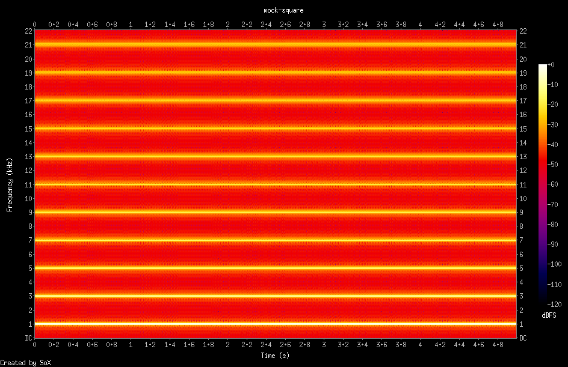

# &#8497; `fft` - perform FFT anomaly analysis

Monitors attached microphone using `record` service and provides FFT functionality as micro-service, processing WAV data and producing JSON and PNG output.  This container may be run locally using Docker, pushed to a Docker registry, and published to any [_Open Horizon_][open-horizon] exchange.

## Status

![Supports amd64 Architecture][amd64-shield]
[](https://microbadger.com/images/dcmartin/amd64_com.github.dcmartin.open-horizon.fft "Get your own image badge on microbadger.com")
[](https://microbadger.com/images/dcmartin/amd64_com.github.dcmartin.open-horizon.fft "Get your own version badge on microbadger.com")
[![Docker Pulls][pulls-amd64]][docker-amd64]

[docker-amd64]: https://hub.docker.com/r/dcmartin/amd64_com.github.dcmartin.open-horizon.fft
[pulls-amd64]: https://img.shields.io/docker/pulls/dcmartin/amd64_com.github.dcmartin.open-horizon.fft.svg

![Supports armhf Architecture][arm-shield]
[](https://microbadger.com/images/dcmartin/arm_com.github.dcmartin.open-horizon.fft "Get your own image badge on microbadger.com")
[](https://microbadger.com/images/dcmartin/arm_com.github.dcmartin.open-horizon.fft "Get your own version badge on microbadger.com")
[![Docker Pulls][pulls-arm]][docker-arm]

[docker-arm]: https://hub.docker.com/r/dcmartin/arm_com.github.dcmartin.open-horizon.fft
[pulls-arm]: https://img.shields.io/docker/pulls/dcmartin/arm_com.github.dcmartin.open-horizon.fft.svg

![Supports aarch64 Architecture][arm64-shield]
[](https://microbadger.com/images/dcmartin/arm64_com.github.dcmartin.open-horizon.fft)
[](https://microbadger.com/images/dcmartin/arm64_com.github.dcmartin.open-horizon.fft)
[![Docker Pulls][pulls-arm64]][docker-arm64]

[docker-arm64]: https://hub.docker.com/r/dcmartin/arm64_com.github.dcmartin.open-horizon.fft
[pulls-arm64]: https://img.shields.io/docker/pulls/dcmartin/arm64_com.github.dcmartin.open-horizon.fft.svg

[arm64-shield]: https://img.shields.io/badge/aarch64-yes-green.svg
[amd64-shield]: https://img.shields.io/badge/amd64-yes-green.svg
[arm-shield]: https://img.shields.io/badge/armhf-yes-green.svg

## Service discovery
+ `org` - `dcmartin@us.ibm.com`
+ `url` - `com.github.dcmartin.open-horizon.fft`
+ `version` - `0.0.1`

## Service Variables

+ `FFT_ANOMALY_TYPE` - type of anomaly; default: `"butter"`; options: { `"butter"`,`"welch"`,*TBD* }
+ `FFT_ANOMALY_LEVEL` - level indicating anomaly; default: `0.05` for `butter` & `128` for `welch`
+ `FFT_ANOMALY_MOCK` - generate mock anomaly; default: `false`; options: `true`, `false`
+ `FFT_INCLUDE_RAW` - include raw results; default: `false`; options: `true`, `false`
+ `FFT_INCLUDE_WAV` - include original audio; default: `false`; options: `true`, `false`
+ `FFT_PERIOD` - interval to poll for new recording; default: `5`; range: \(0,+\)
+ `LOG_LEVEL` - specify level of logging; default `info`; options include (`debug` and `none`)
+ `DEBUG` - default: `false`

## Required Services

### [`record`](https://github.com/dcmartin/open-horizon/blob/beta/record/README.md)
+ `RECORD_DEVICE` - device to record sound; default: `PS3 Eye camera microphone identifier`
+ `RECORD_PERIOD` - interval to poll audio device; default: `10.0` seconds
+ `RECORD_SECONDS` - amount of time to record; default: `5.0` seconds

## Description
This service provides a variety of FFT based anomaly detectors to provide data that may be used for temporal analysis of sound.  The service makes use of the `record` service to poll the device's microphone and collect audio.  The `fft` service polls the `record` service output and when updated, performs the specified anomaly detector (n.b. `FFT_ANOMALY_TYPE`), updating its output to include both the BASE64 encoded audio, but also the analysis data in both BASE64 encoded Python `numpy` array as well as a JSON array.

The `fft` service provides a ReStful API on its designated port and returns a JSON payload; see **EXAMPLE** below.

Options for anomaly analysis:

+ `butter` - perform [Butterworth](https://docs.scipy.org/doc/scipy-0.14.0/reference/generated/scipy.signal.butter.html) order 3 [signal filter](https://docs.scipy.org/doc/scipy/reference/generated/scipy.signal.lfilter.html)
+ `welch` - perform [Welch](https://docs.scipy.org/doc/scipy/reference/generated/scipy.signal.welch.html) power spectral density

## How To Use
Copy this [repository][repository], change to the `fft` directory, then use the **make** command; see below:

```
% mkdir ~/gitdir
% cd ~/gitdir
% git clone http://github.com/dcmartin/open-horizon
% cd open-horizon/fft
% make
...
```

The `fft` value will initially be incomplete until the service completes its initial execution.  Subsequent tests should return a completed payload, see below:

```
% make check
```

**EXAMPLE**

```
{
  "fft": {
    "date": 1555774171,
    "type": "welch",
    "level": 128,
    "id": "",
    "record": {
      "mock": "mixer_1",
      "date": 1555774169,
      "audio": "<base64 encoded WAV>"
    },
    "welch": {
      "data": [ <array of floats>, <array of floats> ]
      "image": "<base64 encoded PNG>"
    }
  },
  "date": 1555774159,
  "hzn": {
    "agreementid": "",
    "arch": "",
    "cpus": 0,
    "device_id": "",
    "exchange_url": "",
    "host_ips": [
      ""
    ],
    "organization": "",
    "ram": 0,
    "pattern": null
  },
  "config": {
    "log_level": "info",
    "debug": true,
    "period": 10,
    "type": "welch",
    "level": 128,
    "mock": false,
    "services": null
  },
  "service": {
    "label": "fft",
    "version": "0.0.1"
  }
}
```

## SAMPLE
A provided `square.wav` file, which may also be created using the `rootfs/usr/bin/mksqwave.sh` script is used as one of the mock data sets.

### Source


### FFT (raw)


### FFT (filter; butter)


## Changelog & Releases

Releases are based on Semantic Versioning, and use the format
of ``MAJOR.MINOR.PATCH``. In a nutshell, the version will be incremented
based on the following:

- ``MAJOR``: Incompatible or major changes.
- ``MINOR``: Backwards-compatible new features and enhancements.
- ``PATCH``: Backwards-compatible bugfixes and package updates.

## Authors & contributors

[David C Martin][dcmartin] (github@dcmartin.com)

[userinput]: https://github.com/dcmartin/open-horizon/blob/master/fft/userinput.json
[service-json]: https://github.com/dcmartin/open-horizon/blob/master/fft/service.json
[build-json]: https://github.com/dcmartin/open-horizon/blob/master/fft/build.json
[dockerfile]: https://github.com/dcmartin/open-horizon/blob/master/fft/Dockerfile


[dcmartin]: https://github.com/dcmartin
[edge-fabric]: https://console.test.cloud.ibm.com/docs/services/edge-fabric/getting-started.html
[edge-install]: https://console.test.cloud.ibm.com/docs/services/edge-fabric/adding-devices.html
[edge-slack]: https://ibm-appsci.slack.com/messages/edge-fabric-users/
[ibm-apikeys]: https://console.bluemix.net/iam/#/apikeys
[ibm-registration]: https://console.bluemix.net/registration/
[issue]: https://github.com/dcmartin/open-horizon/issues
[macos-install]: http://pkg.bluehorizon.network/macos
[open-horizon]: http://github.com/open-horizon/
[repository]: https://github.com/dcmartin/open-horizon
[setup]: https://github.com/dcmartin/open-horizon/blob/master/setup/README.md
